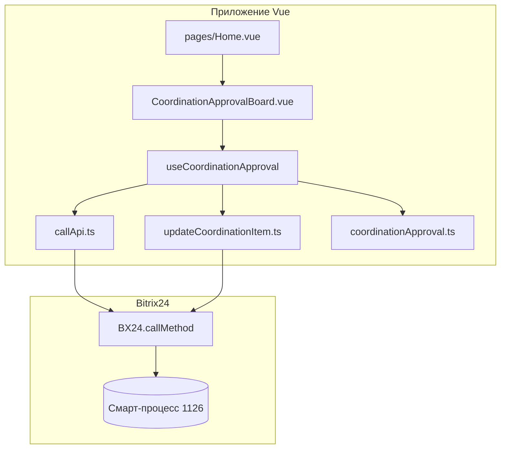

# Согласование — приложение Bitrix24

Веб-приложение для портала Bitrix24: список элементов смарт-процесса **«Согласование»** на стадии «На согласовании», согласование и отклонение с переводом на нужные стадии CRM.

Стек: **Vue 3**, **Vite**, **Vuetify 3**, **TypeScript**, REST API через `BX24.callMethod`.

---

## Содержание

- [Назначение](#назначение)
- [Возможности](#возможности)
- [Требования](#требования)
- [Установка и запуск](#установка-и-запуск)
- [Сборка и публикация в Bitrix24](#сборка-и-публикация-в-bitrix24)
- [Архитектура](#архитектура)
- [Интеграция с CRM](#интеграция-с-crm)
- [Пользовательский интерфейс](#пользовательский-интерфейс)
- [Настройка полей и стадий](#настройка-полей-и-стадий)
- [REST API](#rest-api)
- [Структура проекта](#структура-проекта)
- [Разработка](#разработка)

---

## Назначение

Приложение встраивается в Bitrix24 как локальное/встроенное решение и показывает сотруднику очередь документов (элементов смарт-процесса), ожидающих согласования. После действия элемент исчезает из списка и переводится на соответствующую стадию воронки.

Целевой смарт-процесс: **entityTypeId = 1126** («Согласование»).

---

## Возможности

| Функция | Описание |
|--------|----------|
| KPI «На согласовании» | Количество элементов на рабочей стадии |
| KPI «Сумма в работе» | Сумма полей `opportunity` в компактном виде (тыс. ₽, млн. ₽) |
| Таблица | `v-data-table`: название, пояснение, ответственный, отдел, сумма, файл счёта |
| Отклонить | Красная кнопка → диалог с необязательным комментарием → стадия «Отклонено» |
| Согласовать | Зелёная кнопка → перевод на стадию «Согласовано» без диалога |
| Файл счёта | Ссылка на файл из пользовательского поля, если API вернул URL |

---

## Требования

- Node.js 18+
- Портал Bitrix24 с установленным смарт-процессом согласования (ID **1126**)
- Права приложения на методы: `crm.item.list`, `crm.item.fields`, `crm.item.update`, `user.get`, `department.get`
- Для локальной разработки: HTTPS (в `vite.config.js` используются `cert.pem` и `private.key`)
- Скрипт Bitrix24 API в `index.html`: `//api.bitrix24.com/api/v1/`

---

## Установка и запуск

```bash
# Клонирование / переход в каталог проекта
cd coordination-task

# Установка зависимостей
npm install
# или
install.bat

# Режим разработки (HTTPS, порт 5173)
npm run dev
```

Приложение открывается в контексте Bitrix24 (через placement локального приложения), где доступен глобальный объект `BX24`. Вне портала REST-запросы работать не будут.

### Полезные команды

| Команда | Действие |
|---------|----------|
| `npm run dev` | Dev-сервер Vite |
| `npm run build` | Production-сборка в `dist/` |
| `npm run preview` | Просмотр собранной версии |
| `npm run lint` | ESLint по `src/` |
| `npm test` | Vitest |

---

## Сборка и публикация в Bitrix24

1. Выполнить сборку:

   ```bash
   npm run build
   ```

2. Содержимое каталога `dist/` разместить на хостинге приложения (URL указывается в настройках локального приложения Bitrix24).

3. В карточке приложения на портале указать путь к `index.html` и необходимые scope для CRM.

4. Убедиться, что на портале подключён `BX24` и пользователь авторизован.

Точка входа сборки: `index.html` → `src/main.ts` (полный набор компонентов Vuetify). Альтернативный `src/main.js` с ручным перечислением компонентов в репозитории сохранён, но в `index.html` не подключается.

---

## Архитектура



### Слои

| Слой | Файлы | Ответственность |
|------|--------|-----------------|
| Страница | `src/pages/Home.vue` | Оболочка `v-app` / `v-main`, подключение доски |
| UI | `src/components/coordination/CoordinationApprovalBoard.vue` | KPI, таблица, диалог отклонения |
| Логика | `src/composables/useCoordinationApproval.ts` | Загрузка, маппинг, действия согласовать/отклонить |
| Константы | `src/constants/coordinationApproval.ts` | ID процесса, стадии, коды UF-полей |
| API | `src/functions/callApi.ts`, `updateCoordinationItem.ts` | Обёртки над `BX24` |

---

## Интеграция с CRM

### Смарт-процесс

| Параметр | Значение |
|----------|----------|
| Тип сущности | `1126` |
| Рабочая стадия (список) | `DT1126_144:UC_2M5QYG` |
| Стадия после отклонения | `DT1126_144:CLIENT` |
| Стадия после согласования | `DT1126_144:UC_CB3Y3K` |

### Поля элементов

| Назначение в UI | Код поля | Как определяется |
|-----------------|----------|------------------|
| Название | `title` | Стандартное |
| Ответственный | `assignedById` | Стандартное + `user.get` |
| Сумма | `opportunity`, `currencyId` | Стандартные |
| Пояснение | UF | Автопоиск по подписи «пояснение» в `crm.item.fields` |
| Отдел | UF | Автопоиск по подписи «отдел» или `UF_DEPARTMENT` ответственного |
| Файл счёта | `ufCrm72_1763041372161` | Константа |
| Комментарий при отклонении | `ufCrm72_1777556301690` | Константа, заполняется при отклонении |

Если автопоиск пояснения/отдела не находит поле, в таблице отображается «—». Коды файла и комментария заданы явно в `src/constants/coordinationApproval.ts`.

---

## Пользовательский интерфейс

### Блок KPI

Две карточки над таблицей:

- **НА СОГЛАСОВАНИИ** — число строк в таблице.
- **СУММА В РАБОТЕ** — сумма `opportunity` всех видимых элементов.

### Таблица

Компонент `v-data-table` с пагинацией (10 / 25 / 50), сортировкой по названию и ответственному. Для колонок «Пояснение» и «Отдел» включён перенос длинного текста.

### Действия в строке

| Кнопка | Подсказка | Поведение |
|--------|-----------|-----------|
| Красная | Отклонить | Открывает диалог; комментарий необязателен |
| Зелёная | Согласовать | Сразу обновляет элемент в CRM |

После успешного `crm.item.update` строка удаляется из таблицы, KPI пересчитываются без повторной загрузки списка.

### Диалог отклонения

- Заголовок элемента (название).
- Поле «Комментарий (необязательно)».
- Кнопки «Отмена» и «Отклонить».

При отклонении в CRM уходят `stageId` и значение поля комментария (в том числе пустая строка).

---

## Настройка полей и стадий

Все идентификаторы собраны в одном файле:

**`src/constants/coordinationApproval.ts`**

```ts
export const COORDINATION_ENTITY_TYPE_ID = 1126
export const COORDINATION_STAGE_ID = 'DT1126_144:UC_2M5QYG'
export const COORDINATION_STAGE_REJECTED = 'DT1126_144:CLIENT'
export const COORDINATION_STAGE_APPROVED = 'DT1126_144:UC_CB3Y3K'
export const COORDINATION_REJECT_COMMENT_FIELD = 'ufCrm72_1777556301690'
export const COORDINATION_INVOICE_FILE_FIELD = 'ufCrm72_1763041372161'
```

Подписи для автопоиска UF:

```ts
export const COORDINATION_FIELD_LABELS = {
  explanation: ['пояснение'],
  department: ['отдел'],
}
```

После изменения констант выполните `npm run build` и обновите файлы на хостинге приложения.

---

## REST API

Приложение вызывает методы через `BX24.callMethod` / `BX24.callBatch`.

### Загрузка списка

**`crm.item.list`**

- `entityTypeId`: `1126`
- `filter.stageId`: `DT1126_144:UC_2M5QYG`
- `select`: стандартные поля + найденные UF

Обёртка: `callApi()` в `src/functions/callApi.ts` (пагинация batch при > 50 записей).

### Справочники

| Метод | Назначение |
|-------|------------|
| `crm.item.fields` | Поиск кодов UF по подписи |
| `user.get` | ФИО ответственного, `UF_DEPARTMENT` |
| `department.get` | Названия отделов |

### Обновление элемента

**`crm.item.update`**

Обёртка: `updateCoordinationItem(itemId, fields)` в `src/functions/updateCoordinationItem.ts`.

Пример отклонения:

```json
{
  "entityTypeId": 1126,
  "id": 123,
  "fields": {
    "stageId": "DT1126_144:CLIENT",
    "ufCrm72_1777556301690": "Текст комментария"
  }
}
```

Пример согласования:

```json
{
  "entityTypeId": 1126,
  "id": 123,
  "fields": {
    "stageId": "DT1126_144:UC_CB3Y3K"
  }
}
```

---

## Структура проекта

```
coordination-task/
├── index.html              # Точка входа, подключение BX24 API
├── manifest.json           # Метаданные приложения (шаблон)
├── vite.config.js          # Vite, HTTPS, proxy, chunks
├── package.json
├── src/
│   ├── main.ts             # Точка входа Vue (используется в index.html)
│   ├── main.js             # Альтернативная регистрация Vuetify (не в index.html)
│   ├── App.vue             # Корневой компонент → Home
│   ├── pages/
│   │   └── Home.vue        # Страница приложения
│   ├── components/
│   │   └── coordination/
│   │       └── CoordinationApprovalBoard.vue
│   ├── composables/
│   │   └── useCoordinationApproval.ts
│   ├── constants/
│   │   └── coordinationApproval.ts
│   └── functions/
│       ├── callApi.ts
│       └── updateCoordinationItem.ts
├── dist/                   # Результат npm run build
└── README.md               # Эта документация
```

В репозитории также остались файлы от предыдущих версий приложения (`src/Home.vue`, отчёты, графики и т.д.) — в текущей сборке **не используются**, точка входа ведёт только на `pages/Home.vue`.

---

## Разработка

### Добавление колонки в таблицу

1. Расширить интерфейс `CoordinationRow` в `useCoordinationApproval.ts`.
2. Добавить поле в `select` и маппинг в `fetchItems`.
3. Добавить заголовок в `headers` в `CoordinationApprovalBoard.vue`.
4. При необходимости — слот `#item.<key>` в `v-data-table`.

### Обработка ошибок

- Ошибки загрузки: сообщение над таблицей (`error`).
- Ошибки согласования/отклонения: то же поле, строка в таблице не удаляется.
- Во время действия кнопки блокируются (`isActionLoading`).

### Локальный proxy

В `vite.config.js` настроен proxy для `/requests.json` (отладка вне типичного сценария Bitrix24). Для работы с CRM в dev по-прежнему нужен контекст `BX24` на портале.

### Docker

`Dockerfile` запускает `npm run dev` на порту 5173 — удобно для изолированной разработки UI без полной эмуляции Bitrix24.

---

## Устранение неполадок

| Симптом | Возможная причина |
|---------|-------------------|
| Пустая таблица | Нет элементов на стадии `UC_2M5QYG` или неверный `entityTypeId` |
| «—» в пояснении/отделе | UF не найден по подписи — укажите код поля в константах |
| Ошибка при согласовании | Нет прав на `crm.item.update` или неверный `stageId` |
| `BX24 is not defined` | Приложение открыто не в iframe Bitrix24 |
| Сборка без стилей Vuetify | Проверьте, что в production используется `main.ts`, а не урезанный `main.js` |

---

## Лицензия и контакты

Внутренний проект «Иточка» / Bitrix24. Вопросы по настройке CRM и прав приложения — к администратору портала.
